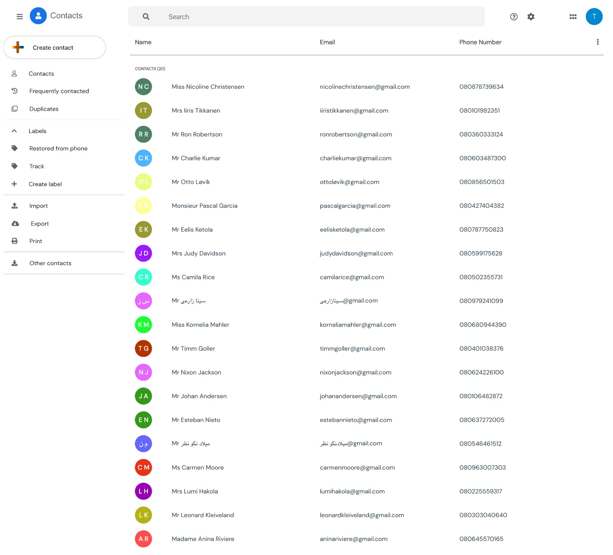
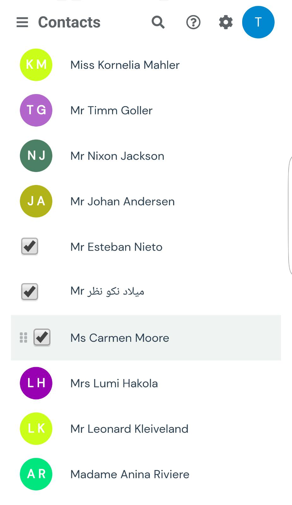

# Google Contacts ui

A VueJS powered Google Contacts Replica App ( contacts.google.com ) using a JSON File as data source to populate contents on the App.

## Installation & Setup

Clone this repository and install its dependencies.

        > git clone https://github.com/temmietope/contacts-ui

        > cd contacts-ui

        > npm install

        > npm serve

Application is live on port 3000

        http://localhost:8080

Or you can view online on [https://contacts-ui.netlify.com/](https://contacts-ui.netlify.com/)

## Screenshots

##### Desktop view

##### Mobile view

## Repository

[https://github.com/temmietope/contacts-ui](https://github.com/temmietope/contacts-ui)
